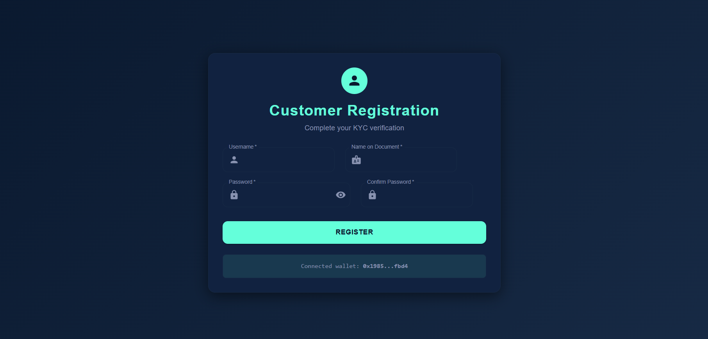

# KYCify - KYC Chain Verification
Decentralized KYC Verification System built with Solidity, React.js, IPFS, and MetaMask/Firebase. Enables secure, role-based interaction between Customers, Banks, and Admins, ensuring privacy, transparency, and immutable document verification on the blockchain.

*Secure, transparent, decentralized KYC verification system*

## Project Overview
This project implements a Know Your Customer (KYC) verification system using blockchain technology to create a secure, transparent, and decentralized identity verification platform for banks and their customers.

## Key Features
- Secure admin portal for bank approval and oversight
- Bank registration and customer verification system
- Blockchain-based document storage and verification
- Transparent audit trail for all KYC processes
- IPFS-based document storage with cryptographic hashing
- Smart contract-based workflow management

## System Flow

### 1. Portal Entry Point

- Central hub for all user types (Banks, Customers, Admins)
- Role-based navigation to appropriate portals
- Wallet connection initiation

### 2. Customer Flow
#### Registration

- Customers create accounts with document details
- Wallet connection establishes blockchain identity

#### Login

- Secure authentication for returning customers

#### Document Submission

- Upload KYC documents to IPFS
- Select bank for verification
- Track submission status

#### Verification History

- View all submitted documents with IPFS hashes
- Check verification status with banks
- Access historical records

### 3. Bank Flow
#### Registration

- Banks register with admin details
- Submitted for admin approval

#### Login

- Secure authentication for approved banks

#### Dashboard

- Manage customer verification requests
- View bank details and status

#### KYC Request Processing

- Review customer documents
- Approve/reject requests
- Add verification remarks

### 4. Admin Flow
#### Login

- Secure admin authentication
- Wallet connection required

#### Dashboard

- Manage bank approval requests
- Monitor system activity

#### Bank Approval

- Review bank registration details
- Approve/deny applications
- View wallet associations

## Technical Implementation

### Blockchain Components

- Solidity smart contracts manage:
  - Role-based access control
  - Verification workflows
  - Immutable record keeping

### IPFS Integration

- Documents stored on IPFS with cryptographic hashing
- Tamper-proof document verification
- Decentralized storage solution

## Workflow Process

1. **Bank Onboarding**
   - Bank registers → Admin approves → Bank becomes active

2. **Customer KYC Submission**
   - Customer registers → Uploads documents → Selects bank → Documents stored on IPFS

3. **Bank Verification**
   - Bank reviews documents → Approves/rejects → Status recorded on blockchain

4. **Completion**
   
   - Customer notified of approval
   - Permanent record created on blockchain

## Getting Started
1. Install MetaMask or compatible wallet
2. Connect wallet to the application
3. Register as appropriate (admin/bank/customer)
4. Follow the on-screen instructions for your role

## Security Features
- All sensitive operations require wallet signatures
- Documents encrypted and stored on IPFS
- Immutable record of all verification activities
- Role-based access control via smart contracts
- Cryptographic proof of document integrity

This system provides a secure, transparent alternative to traditional KYC processes by leveraging blockchain technology for identity verification.
